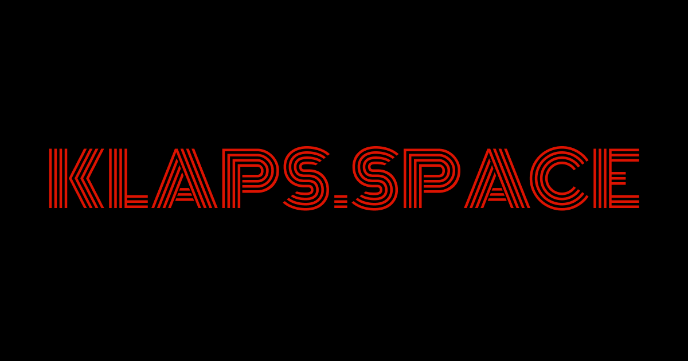

<p align="center">
  
</p>

<h1 align="center">Klaps</h1>

<p align="center">
  <em>Ogólnopolski przewodnik po seansach specjalnych, klasyce i retrospektywach w kinach.</em>
</p>

<p align="center">
  <a href="https://klaps.space">Live Demo</a> ·
  <a href="#getting-started">Getting Started</a> ·
  <a href="#project-structure">Project Structure</a> ·
  <a href="#deployment">Deployment</a>
</p>

---

Klaps is a Polish nationwide guide to special screenings, classic cinema, and retrospectives. It aggregates screening data from public sources across cinemas in Poland and presents them in a clean, filterable interface — so you never miss a screening worth attending.

## Tech Stack

| Layer           | Technology                                                                                                          |
| --------------- | ------------------------------------------------------------------------------------------------------------------- |
| Framework       | [Next.js 16](https://nextjs.org) (App Router, RSC)                                                                  |
| UI Library      | [React 19](https://react.dev) with [React Compiler](https://react.dev/learn/react-compiler)                         |
| Language        | [TypeScript 5](https://www.typescriptlang.org)                                                                      |
| Styling         | [Tailwind CSS 4](https://tailwindcss.com)                                                                           |
| Components      | [Shadcn/ui](https://ui.shadcn.com) (new-york), [Radix UI](https://www.radix-ui.com), [Base UI](https://base-ui.com) |
| Icons           | [Lucide](https://lucide.dev)                                                                                        |
| Maps            | [Leaflet](https://leafletjs.com) + [React Leaflet](https://react-leaflet.js.org)                                    |
| Package Manager | [Bun](https://bun.sh)                                                                                               |
| Runtime         | [Node.js 22](https://nodejs.org)                                                                                    |
| Deployment      | Docker (standalone) via GitHub Actions to GHCR                                                                      |

## Features

- **Screening listings** — browse and filter special screenings by city, genre, date, and keyword
- **Movie catalog** — detailed movie pages with descriptions, cast, directors, ratings, and trailers
- **Cinema directory** — cinema pages with address, interactive map (Leaflet), and current screenings
- **City pages** — per-city overview with cinema counts, screening stats, and listings
- **Genre pages** — paginated movie collections by genre
- **Smart filtering** — persistent city preference (cookie + URL sync), date tabs, genre and search filters
- **SEO optimized** — dynamic `sitemap.xml`, `robots.txt`, Open Graph / Twitter Cards, JSON-LD structured data (WebSite, Movie, ScreeningEvent, MovieTheater, CollectionPage), canonical URLs
- **Responsive design** — mobile-first layout with desktop navigation
- **Accessibility** — semantic HTML, ARIA labels, keyboard navigation
- **Static pages** — FAQ, About, How It Works, Terms, Privacy Policy, Accessibility Statement, Contact, Sitemap

## Project Structure

```
src/
├── app/                    # Next.js App Router pages & layouts
│   ├── (home)/             # Home route group (/, hero, sections)
│   ├── seanse/             # /seanse and /seanse/[id]
│   ├── filmy/              # /filmy and /filmy/[id]
│   ├── kina/               # /kina and /kina/[id]
│   ├── miasta/             # /miasta and /miasta/[id]
│   ├── gatunki/            # /gatunki and /gatunki/[id]
│   ├── faq/                # /faq
│   ├── o-projekcie/        # /o-projekcie (about)
│   ├── jak-to-dziala/      # /jak-to-dziala (how it works)
│   ├── kontakt/            # /kontakt
│   ├── regulamin/          # /regulamin (terms)
│   ├── polityka-prywatnosci/ # /polityka-prywatnosci (privacy)
│   ├── dostepnosc/         # /dostepnosc (accessibility)
│   ├── mapa-witryny/       # /mapa-witryny (HTML sitemap)
│   ├── layout.tsx          # Root layout (fonts, header, footer, CityProvider)
│   ├── sitemap.ts          # Dynamic XML sitemap
│   ├── robots.ts           # Robots.txt
│   └── not-found.tsx       # 404 page
├── components/
│   ├── common/             # Shared components (SectionHeader, MoviePoster, JsonLd, etc.)
│   ├── layout/             # Header & Footer with nav
│   └── ui/                 # Shadcn/ui primitives (Button, Badge, Select, etc.)
├── contexts/               # React contexts (CityProvider, ScreeningsTransition)
├── hooks/                  # Custom hooks (useActiveSection, useCityParam, etc.)
├── interfaces/             # TypeScript interfaces (IMovie, ICinema, ICity, IScreening)
└── lib/                    # Utilities, API client, data fetchers, site config
```

## Pages & Routes

| Route                   | Description                                                                                              |
| ----------------------- | -------------------------------------------------------------------------------------------------------- |
| `/`                     | Home — hero with random screening, screening listings, how it works, mission, cinemas, multi-city movies |
| `/seanse`               | All screenings with filters (city, genre, date, search) and pagination                                   |
| `/seanse/[id]`          | Screening detail — movie info, screening time, cinema, ticket link                                       |
| `/filmy`                | Movie catalog with search, genre filter, and pagination                                                  |
| `/filmy/[id]`           | Movie detail — description, cast, directors, ratings, trailer, screenings                                |
| `/kina`                 | Cinema directory grouped by city                                                                         |
| `/kina/[id]`            | Cinema detail — info, interactive map, current screenings                                                |
| `/miasta`               | Cities list with cinema counts                                                                           |
| `/miasta/[id]`          | City detail — stats, cinemas, screenings                                                                 |
| `/gatunki`              | Genre list                                                                                               |
| `/gatunki/[id]`         | Genre detail — paginated movie collection                                                                |
| `/faq`                  | Frequently asked questions                                                                               |
| `/o-projekcie`          | About the project                                                                                        |
| `/jak-to-dziala`        | How it works                                                                                             |
| `/kontakt`              | Contact page                                                                                             |
| `/regulamin`            | Terms of service                                                                                         |
| `/polityka-prywatnosci` | Privacy policy                                                                                           |
| `/dostepnosc`           | Accessibility statement                                                                                  |
| `/mapa-witryny`         | HTML sitemap                                                                                             |

## Getting Started

### Prerequisites

- [Node.js 22+](https://nodejs.org)
- [Bun](https://bun.sh) (for dependency installation)

### Environment Variables

Create a `.env` file in the project root:

```env
NEXT_PUBLIC_SITE_URL=http://localhost:3000
API_URL=http://localhost:4000
INTERNAL_API_KEY=your-api-key
```

### Install & Run

```bash
# Install dependencies
bun install

# Start development server
bun run dev

# Build for production
bun run build

# Start production server
bun run start

# Lint
bun run lint
```

Open [http://localhost:3000](http://localhost:3000) to see the app.

## Docker

### Build

```bash
docker build \
  --build-arg NEXT_PUBLIC_SITE_URL=https://klaps.space \
  -t klaps .
```

### Run

```bash
docker run -p 3000:3000 \
  -e API_URL=http://your-api:4000 \
  -e INTERNAL_API_KEY=your-key \
  klaps
```

### Docker Compose

The included `docker-compose.yml` is configured for deployment behind [Traefik](https://traefik.io) reverse proxy with automatic HTTPS:

```bash
# Set required env vars
export DOMAIN=klaps.space
export ENV_SUFFIX=prod
export IMAGE_TAG=latest

docker compose up -d
```

The compose file expects a `.env` file and an external `proxy` network for Traefik.

## Deployment

The project uses **GitHub Actions** for CI/CD (`.github/workflows/deploy.yml`):

| Branch | Environment | Domain            | Image Tag |
| ------ | ----------- | ----------------- | --------- |
| `main` | Production  | `klaps.space`     | `latest`  |
| `dev`  | Development | `dev.klaps.space` | `dev`     |

**Pipeline steps:**

1. Build Docker image with `NEXT_PUBLIC_SITE_URL`
2. Push to GitHub Container Registry (`ghcr.io/biplo12/klaps`)
3. SCP `docker-compose.yml` to server
4. SSH deploy: pull image, recreate container, prune old images

**Required GitHub Secrets:**

| Secret              | Description                              |
| ------------------- | ---------------------------------------- |
| `SERVER_IP`         | Deployment server IP                     |
| `SERVER_USER`       | SSH user                                 |
| `SERVER_SSH_KEY`    | SSH private key                          |
| `API_URL`           | Backend API URL                          |
| `INTERNAL_API_KEY`  | API authentication key                   |
| `GA_MEASUREMENT_ID` | Google Analytics measurement ID          |
| `GHCR_PAT`         | GitHub Container Registry token          |
| `DEPLOY_DIR`        | Base deploy path on server               |
| `DOCKER_IMAGE`      | Full Docker image name (e.g. ghcr.io/…) |
| `DOMAIN`            | Site domain (per environment)            |

## Environment Variables

| Variable               | Required | Description                                  |
| ---------------------- | -------- | -------------------------------------------- |
| `NEXT_PUBLIC_SITE_URL` | Yes      | Public site URL (e.g. `https://klaps.space`) |
| `API_URL`              | Yes      | Backend API base URL                         |
| `INTERNAL_API_KEY`     | Yes      | Key for authenticating API requests          |
| `GA_MEASUREMENT_ID`    | No       | Google Analytics measurement ID (production) |

## Open Source

Klaps is an open-source project. The source code is publicly available on GitHub:

| Component              | Repository                                                                             |
| ---------------------- | -------------------------------------------------------------------------------------- |
| **Frontend** (Next.js) | [github.com/Biplo12/klaps](https://github.com/Biplo12/klaps)                           |
| **Backend** (NestJS)   | [github.com/Biplo12/klaps-nest-backend](https://github.com/Biplo12/klaps-nest-backend) |

> The scrapper responsible for collecting screening data is not publicly available for legal reasons.

## Contributing

See [CONTRIBUTING.md](CONTRIBUTING.md) for guidelines on how to contribute.

## Security

To report a vulnerability, see [SECURITY.md](SECURITY.md).

## License

This project is licensed under the [MIT License](LICENSE).
